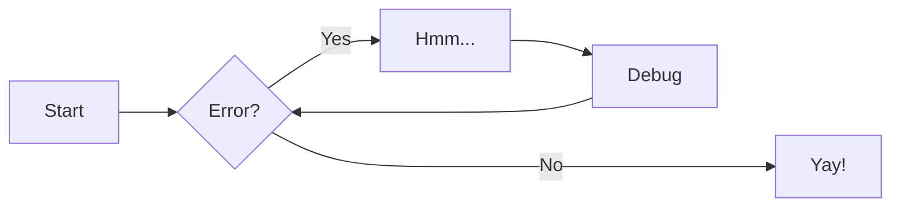

---
hide:
- footer
draft: false
date: 2025-05-25
slug: mermaid-diagrams
categories:
  - Mermaid
---

# Mermaid diagrams

Here's the example from [MkDocs Material documentation](https://squidfunk.github.io/mkdocs-material/reference/diagrams/#using-flowcharts): 

